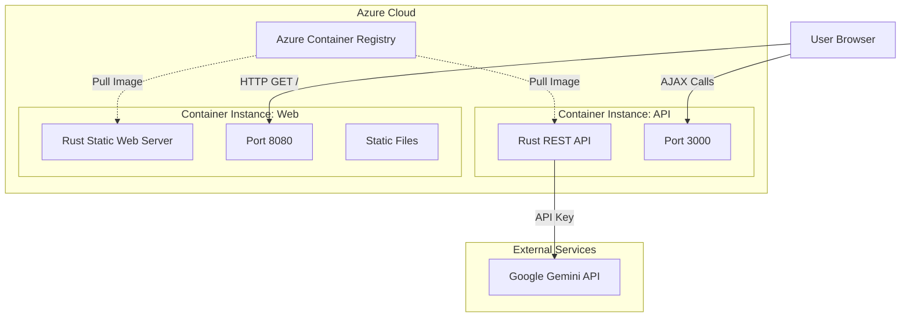

# Azure Deployment Plan: Rust Web App & API

This document outlines the detailed design and step-by-step plan to containerize and deploy the Rust-based web application and REST API to Azure Container Instances (ACI).

## 1. System Architecture

We will deploy two separate containers to Azure Container Instances. The Web Server container will serve the static frontend, which will make client-side AJAX requests to the API Server container.

## 2. Component Design

### A. API Server (`rust-simple-rest-api`)
*   **Current State**: Binds to `127.0.0.1:3000`.
*   **Required Change**: Must bind to `0.0.0.0:3000` to accept external traffic within the container.
*   **Configuration**: Needs `GEMINI_API_KEY` environment variable at runtime.
*   **Docker Strategy**: Multi-stage build (Builder -> Runtime) to keep image small.

### B. Web Server (`rust-static-web-server`)
*   **Current State**: Serves static files from `./static`.
*   **Required Change**: The frontend JavaScript (`items-manager.js`, `genai-chat.js`) currently hardcodes `localhost:3000`.
*   **Configuration Strategy**: 
    1.  Create a `config.js` file in `static/js/` that defines the API URL.
    2.  Update HTML to load this config.
    3.  Update JS components to read from this config.
    4.  For local dev, config points to localhost. For prod, we update it before building the Docker image (or use a startup script to overwrite it).

## 3. Implementation Plan

### Phase 1: Code Preparation (Local)
1.  **API Update**: Modify `rust-simple-rest-api/src/main.rs` to bind to `0.0.0.0`.
2.  **Frontend Refactor**:
    *   Create `rust-static-web-server/static/config.js`.
    *   Update `index.html` to include `config.js`.
    *   Refactor `items-manager.js` and `genai-chat.js` to use `window.APP_CONFIG.apiUrl`.

### Phase 2: Containerization
3.  **Create Dockerfile for API**:
    *   Base: `rust:latest` (build), `debian:bookworm-slim` (runtime).
    *   Expose: 3000.
4.  **Create Dockerfile for Web**:
    *   Base: `rust:latest` (build), `debian:bookworm-slim` (runtime).
    *   Expose: 8080.
    *   Copy `static/` folder to image.

### Phase 3: Azure Infrastructure Setup
5.  **Resource Group**: Create a new Resource Group (e.g., `rg-rust-app`).
6.  **Container Registry**: Create an Azure Container Registry (ACR) (e.g., `acrrustapp`).
7.  **Login**: Authenticate local Docker with ACR.

### Phase 4: Build & Deploy API
8.  **Build API Image**: `docker build -t acrrustapp.azurecr.io/api:v1 ...`
9.  **Push API Image**: `docker push ...`
10. **Deploy API Container**:
    *   Create ACI instance.
    *   Set Environment Variable: `GEMINI_API_KEY`.
    *   Expose Port 3000 (Public).
    *   **Output**: Get the Public IP/FQDN of the API (e.g., `api.region.azurecontainer.io`).

### Phase 5: Build & Deploy Web
11. **Update Config**: Modify `static/config.js` to point to the *real* API URL from Step 10.
12. **Build Web Image**: `docker build -t acrrustapp.azurecr.io/web:v1 ...`
13. **Push Web Image**: `docker push ...`
14. **Deploy Web Container**:
    *   Create ACI instance.
    *   Expose Port 8080 (Public).

### Phase 6: Verification
15. **Test**: Open Web URL in browser. Verify it loads and can successfully chat (via API) and manage items.
