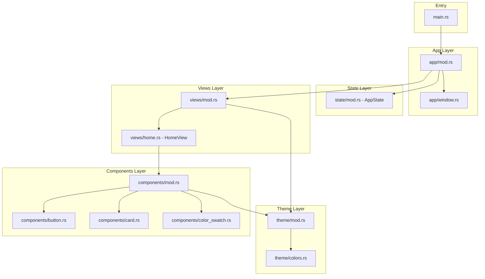

# GPUI Application Architecture

This document describes the architecture and design patterns used in this GPUI application.

## Overview

This application follows a modular, component-based architecture inspired by modern UI frameworks. The design prioritizes:

- **Separation of Concerns**: Each module has a single responsibility
- **Reusability**: Components and utilities can be shared across views
- **Extensibility**: Clear patterns for adding new features
- **Maintainability**: Logical organization guides developers

## Directory Structure

```
src/
├── main.rs              # Entry point - minimal, delegates to app
├── lib.rs               # Library root - re-exports public API
├── app/
│   ├── mod.rs           # Application initialization and setup
│   └── window.rs        # Window configuration and management
├── components/
│   ├── mod.rs           # Component exports
│   ├── button.rs        # Reusable Button component
│   ├── card.rs          # Reusable Card container
│   └── color_swatch.rs  # Color swatch component
├── views/
│   ├── mod.rs           # View exports and navigation
│   └── home.rs          # Home view
├── state/
│   └── mod.rs           # Global AppState management
├── theme/
│   ├── mod.rs           # Theme struct and configuration
│   └── colors.rs        # Color palette definitions
└── utils/
    └── mod.rs           # Utility functions
```

## Architecture Diagram



## Module Descriptions

### Entry Point (`main.rs`)

The entry point is intentionally minimal. It:
- Creates the GPUI Application
- Delegates to the app module for setup
- Starts the event loop

### Library Root (`lib.rs`)

Re-exports public API for the application, allowing:
- Clean imports in main.rs
- Potential use as a library in other projects
- Centralized public interface

### App Layer (`app/`)

#### `app/mod.rs`
- `run()` function to start the application
- Application-level configuration
- Coordinates window creation and state initialization

#### `app/window.rs`
- `WindowConfig` struct with window options
- Window creation helpers
- Default window bounds and sizing

### Theme Layer (`theme/`)

#### `theme/mod.rs`
- `Theme` struct combining colors, spacing, typography
- Global theme instance for consistent styling

#### `theme/colors.rs`
- `ColorPalette` struct with semantic color names
- Primary, secondary, background, text colors
- Color utility functions

### Components Layer (`components/`)

Reusable UI building blocks. Each component:
- Implements the `Render` trait or provides builder functions
- Uses theme for consistent styling
- Is self-contained and testable

#### `components/button.rs`
- `Button` component with customizable label
- Hover and press states
- Uses theme colors

#### `components/card.rs`
- `Card` container component
- Consistent padding, shadow, border
- Wraps child elements

#### `components/color_swatch.rs`
- `ColorSwatch` component for displaying colors
- Configurable size and color

### Views Layer (`views/`)

Full-screen views that compose components.

#### `views/mod.rs`
- Exports all views
- Future: Navigation/routing logic

#### `views/home.rs`
- `HomeView` - the main view
- Composes Card, Button, ColorSwatch components
- Demonstrates component usage

### State Layer (`state/`)

#### `state/mod.rs`
- `AppState` struct for global state
- Shared data across views
- Future: State mutation helpers

### Utils Layer (`utils/`)

#### `utils/mod.rs`
- Helper functions
- Common utilities

## Design Patterns

### Component Pattern

Components are structs that implement `Render`:

```rust
pub struct MyComponent {
    // component state
}

impl Render for MyComponent {
    fn render(&mut self, _window: &mut Window, _cx: &mut Context<Self>) -> impl IntoElement {
        div()
            .child("Hello")
    }
}
```

### Builder Pattern

Components use method chaining for configuration:

```rust
Button::new("Click me")
    .on_click(|_| println!("Clicked!"))
```

### Theme Injection

Components access theme through context or direct import:

```rust
use crate::theme::colors;

div().bg(colors::background())
```

## Extension Guide

### Adding a New Component

1. Create `src/components/my_component.rs`
2. Define struct and implement `Render` or provide builder
3. Add `pub mod my_component;` to `src/components/mod.rs`
4. Re-export: `pub use my_component::MyComponent;`

### Adding a New View

1. Create `src/views/my_view.rs`
2. Define view struct implementing `Render`
3. Add `pub mod my_view;` to `src/views/mod.rs`
4. Re-export: `pub use my_view::MyView;`

### Adding Colors

1. Add color constants to `src/theme/colors.rs`
2. Use semantic naming: `surface_elevated()`, `text_muted()`

### Adding State

1. Add fields to `AppState` in `src/state/mod.rs`
2. Provide methods for state mutations
3. Access state through GPUI's context system

## Future Enhancements

- **Navigation**: Add router for multi-view navigation
- **Services**: Add `src/services/` for API calls
- **Models**: Add `src/models/` for data structures
- **Testing**: Add component and integration tests
- **Accessibility**: Add a11y attributes to components