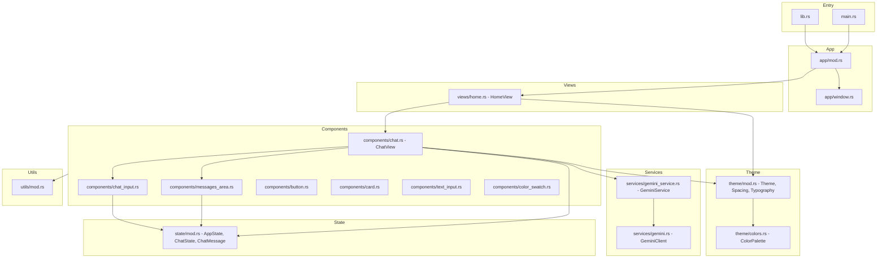

# GPUI Chat Application Architecture

This document describes the updated architecture of the GPUI chat application with Gemini AI integration. It reflects the current src directory structure and core design decisions.

## Overview

The application is a modular GPUI app that renders a full-screen chat interface. It composes reusable UI components, a view layer, a services layer for AI integration, centralized state, and a theme system. Responsibilities are clearly separated:

- UI Composition: Views orchestrate components
- Interaction: Components emit and subscribe to events
- Services: External API integration (Gemini) encapsulated behind a client and a service
- State: Centralized application and chat state models
- Theme: Consistent styling via colors, spacing, and typography
- Utilities: Common helpers

## Directory Structure

```
src/
├── main.rs                  # Entry point
├── lib.rs                   # Library root, exports public API
├── app/                     # Application boot and window configuration
│   ├── mod.rs               # run(), run_with_config(), window wiring
│   └── window.rs            # WindowConfig and options
├── components/              # Reusable UI components
│   ├── button.rs
│   ├── card.rs
│   ├── chat.rs              # ChatView orchestrator
│   ├── chat_input.rs        # Text input and message dispatch
│   ├── color_swatch.rs
│   ├── messages_area.rs     # Message list display
│   ├── mod.rs               # Exports
│   └── text_input.rs
├── services/                # External integrations
│   ├── gemini.rs            # GeminiClient API wrapper
│   ├── gemini_service.rs    # Event-driven GeminiService
│   └── mod.rs               # Exports
├── state/                   # Global and chat state
│   └── mod.rs
├── theme/                   # Styling system
│   ├── colors.rs
│   └── mod.rs               # Theme, Spacing, Typography
├── utils/                   # Generic helpers
│   └── mod.rs
└── views/                   # Screens
    ├── home.rs              # Hosts ChatView
    └── mod.rs
```

## Architecture Diagram



## Module Descriptions

### Entry Point

- [Rust.fn main()](src/main.rs:1): Delegates to application bootstrap [Rust.fn run](src/app/mod.rs:40)

### Library Root

- [src/lib.rs](src/lib.rs): Re-exports the public API for convenient use in main and potential library consumers
  - Exports: [Rust.mod app](src/app/mod.rs:1), [Rust.mod components](src/components/mod.rs:1), [Rust.mod services](src/services/mod.rs:1), [Rust.mod state](src/state/mod.rs:1), [Rust.mod theme](src/theme/mod.rs:1), [Rust.mod utils](src/utils/mod.rs:1), [Rust.mod views](src/views/mod.rs:1)
  - Re-exports: [Rust.fn run](src/app/mod.rs:40), [Rust.fn run_with_config](src/app/mod.rs:68), WindowConfig, AppState, Theme, HomeView

### App Layer

- [Rust.fn run](src/app/mod.rs:40): Creates Application, configures window, opens [Rust.struct HomeView](src/views/home.rs:15)
- [Rust.fn run_with_config](src/app/mod.rs:68): Starts application with a custom WindowConfig
- window config in [src/app/window.rs](src/app/window.rs): Provides WindowConfig builder and options

### Views Layer

- [Rust.struct HomeView](src/views/home.rs:15)
  - Hosts [Rust.struct ChatView](src/components/chat.rs:17) as main content
  - Demonstrates full-screen layout and integration with theme colors

### Components Layer

- [Rust.struct ChatView](src/components/chat.rs:17)
  - Orchestrates:
    - [components/messages_area.rs](src/components/messages_area.rs): Displays messages; subscribes to events
    - [components/chat_input.rs](src/components/chat_input.rs): Emits [ChatInputEvent] on send; text entry and submit
    - [Rust.struct GeminiService](src/services/gemini_service.rs:24): Processes user input and returns assistant messages
  - Subscriptions:
    - ChatInputEvent -> add user message to MessagesArea and forward to GeminiService [Rust.fn handle_chat_input](src/services/gemini_service.rs:52)
    - [Rust.enum GeminiServiceEvent](src/services/gemini_service.rs:13) -> update MessagesArea with assistant responses or errors
- Additional reusable components:
  - [src/components/button.rs](src/components/button.rs), [src/components/card.rs](src/components/card.rs), [src/components/text_input.rs](src/components/text_input.rs), [src/components/color_swatch.rs](src/components/color_swatch.rs)
- [src/components/mod.rs](src/components/mod.rs): Aggregates and re-exports component constructors and entities

### Services Layer

- [services/gemini.rs](src/services/gemini.rs): GeminiClient
  - Wraps HTTP/API calls to Gemini; model selection and send_message
- [Rust.struct GeminiService](src/services/gemini_service.rs:24)
  - Event-driven service encapsulating:
    - API key discovery via GEMINI_API_KEY
    - Conversation history accumulation using [Rust.struct ChatMessage](src/state/mod.rs:19)
    - Asynchronous request orchestration via a single-thread Tokio runtime
    - Emission of [Rust.enum GeminiServiceEvent](src/services/gemini_service.rs:13): AssistantMessage, Error, Processing
  - Public helpers:
    - [Rust.fn handle_chat_input](src/services/gemini_service.rs:52)
    - is_processing, is_configured, clear_history
- [src/services/mod.rs](src/services/mod.rs): Exports GeminiClient and GeminiService

### State Layer

- [Rust.struct AppState](src/state/mod.rs:60): Title, current_view, dark_mode, chat, theme
- [Rust.struct ChatState](src/state/mod.rs:28): messages, is_loading, error, api_key
- [Rust.struct ChatMessage](src/state/mod.rs:19): id, role, content, timestamp
- [Rust.enum MessageRole](src/state/mod.rs:12): User, Assistant
- Navigation and theme toggles via AppState methods; default values and builder methods

### Theme Layer

- [Rust.struct Theme](src/theme/mod.rs:83): colors, spacing, typography
- [Rust.struct Spacing](src/theme/mod.rs:12): xs..xxl defaults
- [Rust.struct Typography](src/theme/mod.rs:49): size_sm..size_heading defaults
- Color system:
  - [src/theme/colors.rs](src/theme/colors.rs): [Rust.struct ColorPalette](src/theme/colors.rs:1) and swatch helpers used by views/components
- [src/theme/mod.rs](src/theme/mod.rs): theme() helper returning Theme::default

### Utils Layer

- [src/utils/mod.rs](src/utils/mod.rs): to_pixels, clamp, lerp

## Data and Event Flow

1. User types a message in ChatInput and presses send
2. ChatInput emits ChatInputEvent
3. ChatView subscription:
   - Appends a user message to MessagesArea
   - Forwards event to GeminiService
4. GeminiService:
   - Emits Processing
   - Sends conversation history to GeminiClient
   - Emits AssistantMessage or Error
5. ChatView subscription:
   - Appends assistant message or error to MessagesArea
6. UI updates propagate via cx.notify()

## Key Design Patterns

- Event-driven architecture
  - Components and services communicate via typed events and subscriptions: [Rust.enum GeminiServiceEvent](src/services/gemini_service.rs:13), ChatInputEvent, MessageEvent
- Orchestrator component
  - [Rust.struct ChatView](src/components/chat.rs:17) coordinates subcomponents and service interactions
- Service layer encapsulation
  - [Rust.struct GeminiService](src/services/gemini_service.rs:24) hides async details, API keys, runtime setup
- State modeling
  - [Rust.struct AppState](src/state/mod.rs:60) and [Rust.struct ChatState](src/state/mod.rs:28) define shared, testable data
- Theming and styling
  - [Rust.struct Theme](src/theme/mod.rs:83), [Rust.struct Spacing](src/theme/mod.rs:12), [Rust.struct Typography](src/theme/mod.rs:49), [Rust.struct ColorPalette](src/theme/colors.rs:1) provide consistent, composable styling primitives

## AI Integration

- Service: [Rust.struct GeminiService](src/services/gemini_service.rs:24)
  - Async processing with a contained Tokio runtime
  - Tracks conversation history using [Rust.struct ChatMessage](src/state/mod.rs:19)
  - Emits AssistantMessage to update UI
- Client: services/gemini.rs
  - Model selection (e.g., gemini-2.0-flash)
  - Single API surface: send_message(messages) -> response_text
- Error handling
  - Emits Error events on network or configuration failures
  - Displays errors inline via MessagesArea

## Extension Guide

- Add a new component
  - Create `src/components/my_component.rs`
  - Export in [src/components/mod.rs](src/components/mod.rs)
  - Compose it inside [Rust.struct ChatView](src/components/chat.rs:17) or a view
- Add a new view
  - Create `src/views/my_view.rs`
  - Register in [src/views/mod.rs](src/views/mod.rs:1)
  - Navigate by setting AppState.current_view
- Add a new service
  - Create client in `src/services/my_client.rs`
  - Create service in `src/services/my_service.rs` implementing EventEmitter
  - Wire subscriptions inside ChatView or a new orchestrator
- Extend state
  - Add fields in [Rust.struct AppState](src/state/mod.rs:60) or [Rust.struct ChatState](src/state/mod.rs:28)
  - Model new events and update flows

## Testing Notes

- Integration tests can exercise service flows and event emissions
- Follow the pattern in tests/gemini_integration_test.rs for API integration scenarios

## Quick Start Examples

- Rust

```Rust
// Entry with default window
use rust_gpui_app::app;

fn main() {
    app::run();
}
```

```Rust
// Custom window configuration
use rust_gpui_app::app::{run_with_config, WindowConfig};

fn main() {
    let config = WindowConfig::new()
        .with_size(800.0, 600.0)
        .with_title("GPUI Chat");
    run_with_config(config, "User");
}
```

## Future Enhancements

- Streaming responses and partial render updates
- Persistent conversation history and storage
- Multi-view navigation and routing
- Rich message types: code blocks, citations, actions
- Advanced theming: dark/light modes and user preferences
- Component-level unit and integration tests